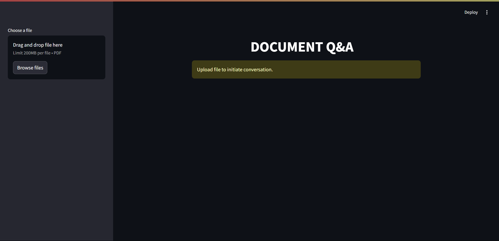
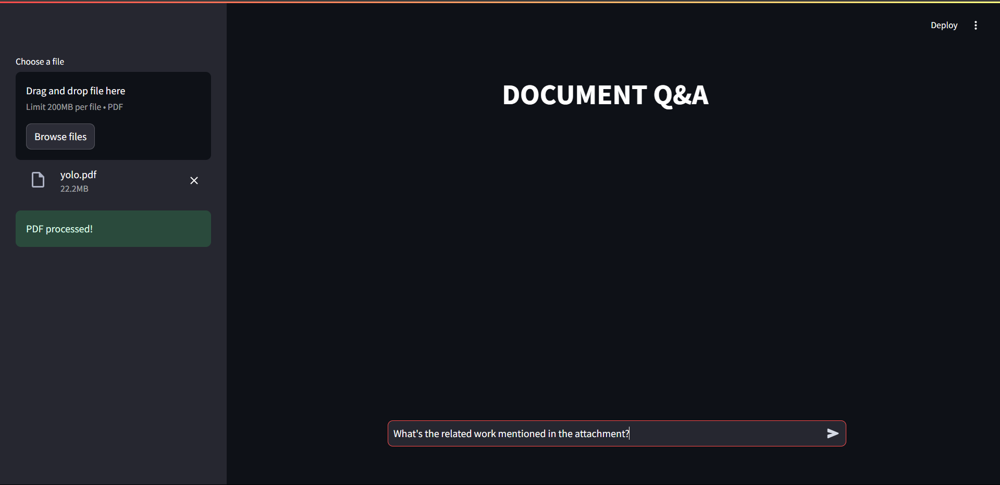
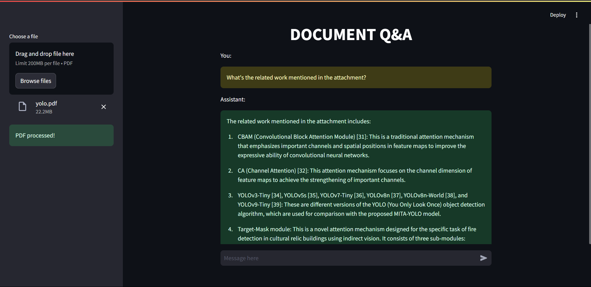

# DOCUMENT Q&A APP

## DESCRIPTION

This Q&A application leverages Langchain, Groq, Hugging Face, and Streamlit to provide intelligent document-based question answering. Users can upload PDF files, and the application uses retrieval-augmented generation (RAG) to answer user queries based on the uploaded document and the context of conversations along with history.

## TOOLS AND MODELS

- **LANGCHAIN**
- **GROQ** : *(`llama-3.1-70b-versatile` LLM)*
- **HUGGING-FACE**
- **FAISS (VectorDB)**
- **STREAMLIT**

## INSTALLING REQUIREMENTS:

```bash
pip install -r requirements.txt
```

## GENERATING API KEYS

Generate API keys for
  - `Groq` for inferencing hosted LLM models [`here`](https://console.groq.com/keys?_gl=1*1vkvjis*_gcl_au*MjE2MzY4Nzg1LjE3MzIzNTU3MzI.*_ga*MjExOTY4NjkyNC4xNzMyMzU1NzMz*_ga_4TD0X2GEZG*MTczMjQ2OTk1Ny40LjEuMTczMjQ3MDAxMi41LjAuMA..).
  - `Hugging-face` embeddings for embedding the documents [`here`](https://huggingface.co/settings/tokens).

## RUNNING THE APPLICATION

```bash
streamlit run app.py
```

Once the application is running, navigate to [`localhost`](http://localhost:8501) to interact with the Document Q&A system.

## FUNCTIONALITY

1. **Upload a PDF file**: Select a PDF document using the file uploader in the sidebar. The app will split the document into manageable chunks for efficient search and retrieval.
2. **Ask a question**: Once the PDF is processed, type your query in the chat input field. The app will generate a response based on the document's content and chat history.

## INTERFACE

### HOME PAGE:

<div class="row">
    
</div>

### INPUT:

<div class="row">
    
</div>

### RESPONSE:

<div class="row">
    
</div>
